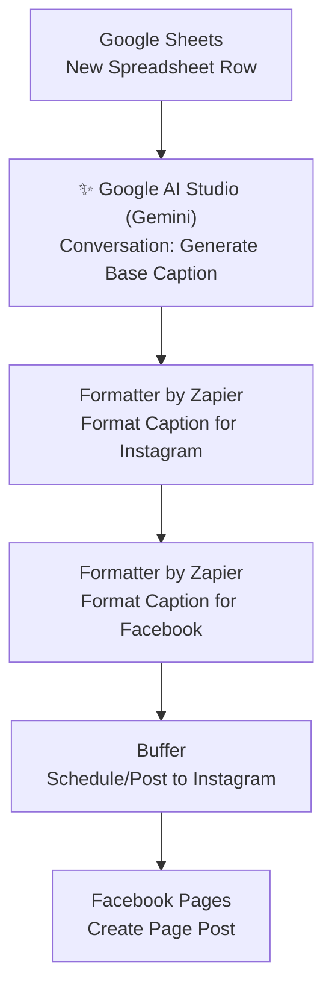

# ai-social-media-caption-generator--Zapier
An AI-powered Zapier automation that generates social media captions using Google Gemini from Google Sheets data, formats platform-specific content, and automatically publishes posts to Instagram and Facebook.
 # AI Social Media Caption Generator

> An AI-powered Zapier automation that turns a simple spreadsheet row into fully published social media posts — generating platform-specific captions with Google AI Studio (Gemini), formatting them appropriately for Instagram and Facebook, and publishing automatically via Buffer and Facebook Pages.


---

## Table of Contents

- [Project Overview](#-project-overview)
- [Workflow Diagram](#-workflow-diagram)
- [Features](#-features)
- [Technologies Used](#-technologies-used)
- [Folder Structure](#-folder-structure)
- [Setup Guide](#-setup-guide)
- [Use Cases](#-use-cases)
- [Screenshots](#-screenshots)
- [Troubleshooting](#-troubleshooting)
- [Best Practices](#-best-practices)
- [Contributing](#-contributing)
- [License](#-license)
- [Author](#-author)

---

## Project Overview

Writing and formatting unique, platform-appropriate captions for every social post — and then manually publishing to each channel — is repetitive and time-consuming, especially for solo creators, freelancers, and small marketing teams. **AI Social Media Caption Generator** solves this with a 6-step Zapier automation that turns a single content idea logged in Google Sheets into fully published Instagram and Facebook posts.

Whenever a new content row is added to a Google Sheet, the workflow:

1. Detects the new row (containing content details such as topic, product, or campaign notes).
2. Sends that content brief to **Google AI Studio (Gemini)** to generate a base caption.
3. Uses **Formatter by Zapier** to adapt the caption specifically for **Instagram** (e.g., hashtag styling, length).
4. Uses a second **Formatter by Zapier** step to adapt the caption for **Facebook** (e.g., tone, formatting conventions).
5. Publishes the Instagram-formatted caption via **Buffer**.
6. Publishes the Facebook-formatted caption directly via **Facebook Pages**.

This gives solo creators and small teams a "type an idea, get two published posts" pipeline — eliminating repetitive caption writing and manual cross-platform publishing.

---

##  Workflow Diagram



A detailed breakdown of each step and the reasoning behind this design is available in [`docs/workflow-diagram.md`](docs/workflow-diagram.md).

---

## Features

- **AI-Generated Captions** — Uses Google AI Studio's Gemini model to write engaging, on-topic captions from a simple content brief instead of starting from a blank page.
- **Platform-Specific Formatting** — Two dedicated Formatter by Zapier steps tailor the same base caption differently for Instagram and Facebook, respecting each platform's tone and conventions.
- **Multi-Platform Auto-Publishing** — Automatically publishes to Instagram (via Buffer) and Facebook (via Facebook Pages) from a single trigger.
- **Spreadsheet-Driven Workflow** — Content ideas are logged in a familiar, easy-to-use Google Sheet — no special content management tool required.
- **Consistent Cross-Platform Messaging** — Both platforms originate from the same AI-generated core message, keeping brand voice consistent while respecting platform norms.
- **Fully No-Code** — Built entirely in Zapier, making the entire content pipeline easy to inspect, adjust, and hand off to non-technical team members.

---

## Technologies Used

| Tool / Service | Role in Workflow |
|---|---|
| **Zapier** | Core automation/orchestration platform |
| **Google Sheets** | Content brief intake (trigger) |
| **Google AI Studio (Gemini)** | AI-generated base caption |
| **Formatter by Zapier** | Platform-specific caption formatting (Instagram and Facebook, two separate steps) |
| **Buffer** | Publishing/scheduling the Instagram post |
| **Facebook Pages** | Publishing the Facebook post directly |

---

## Folder Structure

```
ai-social-media-caption-generator/
│
├── README.md                     # Main project documentation (this file)
├── LICENSE                       # MIT License
├── CONTRIBUTING.md               # Guidelines for contributing to this project
│
├── docs/
│   └── workflow-diagram.md       # Detailed step-by-step workflow breakdown
│
└── screenshots/
    └── README.md                 # Index/placeholder for workflow & setup screenshots
```

> **Note:** As this is a Zapier-based automation (not a code application), the repository is documentation-first — structured to showcase design decisions and configuration clearly, the same way source files showcase logic in a coded project.

---

## Setup Guide

Follow these steps to recreate this automation in your own Zapier account.

### Prerequisites

- A Zapier account (a paid plan may be required for multi-step Zaps with premium app integrations)
- A Google Sheets spreadsheet set up with columns for content details (e.g., Topic, Key Message, Call-to-Action)
- A Google AI Studio account with Gemini API access enabled
- A Buffer account connected to your Instagram profile
- A Facebook Page connected via the Facebook Pages integration

### Step-by-Step Configuration

**1. Trigger — Google Sheets: New Spreadsheet Row**
   - App: `Google Sheets`
   - Trigger event: `New Spreadsheet Row`
   - Select the spreadsheet and worksheet where content ideas are logged.

**2. Action — Google AI Studio (Gemini): Conversation**
   - App: `Google AI Studio (Gemini)`
   - Action event: `Conversation`
   - Map the relevant spreadsheet columns (topic, key message, tone, etc.) into the prompt.
   - Instruct Gemini to generate an engaging, on-brand base caption, e.g.: *"Write a short, engaging social media caption based on the following content brief."*

**3. Action — Formatter by Zapier: Instagram**
   - App: `Formatter by Zapier`
   - Utility: Text formatting (e.g., adjusting length, adding line breaks, appending relevant hashtags)
   - Transform the AI-generated base caption into an Instagram-ready version.

**4. Action — Formatter by Zapier: Facebook**
   - App: `Formatter by Zapier`
   - Utility: Text formatting (e.g., adjusting tone, removing excess hashtags, adapting length)
   - Transform the same base caption into a Facebook-appropriate version.

**5. Action — Buffer: Instagram**
   - App: `Buffer`
   - Action event: `Create Post` (or equivalent scheduling action)
   - Map the Instagram-formatted caption from Step 3 and select the connected Instagram profile.

**6. Action — Facebook Pages: Create Page Post**
   - App: `Facebook Pages`
   - Action event: `Create Page Post`
   - Map the Facebook-formatted caption from Step 4 and select the connected Facebook Page.

### Testing the Zap

1. Turn the Zap on in Zapier.
2. Add a new test row to your Google Sheet with sample content details.
3. Confirm:
   - Gemini generates a relevant base caption.
   - Both Formatter steps produce appropriately adapted versions for Instagram and Facebook.
   - Buffer receives the Instagram post (check your Buffer queue or connected account).
   - Facebook Pages successfully publishes the Facebook post.
4. Review the published/queued posts for tone, formatting, and accuracy before relying on the Zap for live content.

---

## Use Cases

- **Solo Content Creators** — Turn a quick content idea into fully formatted, multi-platform posts without manual writing or formatting.
- **Freelance Social Media Managers** — Manage multiple client accounts by logging content briefs in a shared spreadsheet and letting the Zap handle publishing.
- **Small Businesses** — Maintain a consistent social media presence without a dedicated in-house content writer.
- **Marketing Agencies** — Standardize caption generation across client accounts while still tailoring output per platform.
- **Personal Brands** — Keep a content calendar in Google Sheets and automatically push ideas live across Instagram and Facebook.

---

## Screenshots

Screenshots of the live Zap configuration and sample outputs are organized in the [`screenshots/`](screenshots/) folder.

| Screenshot | Description |
|---|---|
| `01-zap-overview.png` | Full 6-step Zap overview in Zapier |
| `02-sheets-trigger-config.png` | Google Sheets "New Spreadsheet Row" trigger configuration |
| `03-gemini-caption-config.png` | Google AI Studio (Gemini) Conversation step configuration |
| `04-formatter-instagram-config.png` | Formatter by Zapier — Instagram formatting configuration |
| `05-formatter-facebook-config.png` | Formatter by Zapier — Facebook formatting configuration |
| `06-buffer-instagram-post.png` | Sample Instagram post queued/published via Buffer |
| `07-facebook-page-post.png` | Sample Facebook Page post published via Facebook Pages |

> Add your actual screenshots to the `screenshots/` folder using the filenames above, or update the table to match your naming convention.

---

## Troubleshooting

| Issue | Likely Cause | Solution |
|---|---|---|
| Zap doesn't trigger on new spreadsheet rows | Wrong sheet/worksheet selected, or row added outside the tracked range | Confirm the correct spreadsheet and worksheet are selected in the trigger step |
| Gemini-generated caption is off-topic or generic | Content brief columns not clearly mapped into the prompt | Review field mapping from Step 1; add more descriptive context to the Gemini prompt |
| Instagram caption exceeds platform limits or looks malformed | Formatter step not configured for Instagram's caption/hashtag conventions | Adjust the Formatter utility settings (length trimming, hashtag placement) |
| Facebook caption reads too casual/formal for brand voice | Formatter step tone settings don't match brand guidelines | Update the Facebook Formatter step's find/replace or text transformation rules |
| Buffer post fails to queue or publish | Buffer account disconnected, or Instagram profile not properly linked in Buffer | Reconnect Buffer in Zapier and confirm the Instagram profile is active in your Buffer account |
| Facebook Pages post fails to publish | Facebook Page permissions expired, or wrong Page selected | Reconnect the Facebook Pages integration and confirm the correct Page is selected |
| Duplicate posts published for the same row | Zap re-triggered manually on an already-processed row | Avoid manually re-running the Zap on rows that have already generated posts |

---

## Best Practices

- **Write a clear, structured content brief format.** Consistent spreadsheet columns (Topic, Key Message, Tone, CTA) make it easier for Gemini to generate relevant, on-brand captions.
- **Keep platform formatting rules explicit.** Define exactly how Instagram and Facebook versions should differ (hashtags, emoji use, length) within each Formatter step.
- **Review before scaling volume.** Manually check a handful of AI-generated and published posts before relying on the Zap for high-frequency publishing.
- **Separate drafting from publishing where needed.** For added safety, consider routing posts to Buffer's draft/review queue instead of auto-publishing immediately, especially early on.
- **Maintain brand voice consistency.** Periodically refine the Gemini prompt as your brand voice evolves, so captions stay aligned with current messaging.
- **Monitor API and task usage.** Multi-step Zaps with AI and multiple app integrations consume more Zapier tasks and Gemini API calls — keep usage within your plan's limits.

---

## Contributing

Contributions, suggestions, and improvements are welcome! Please see [CONTRIBUTING.md](CONTRIBUTING.md) for guidelines on how to propose changes, report issues, or suggest new features for this automation.

---

## License

This project is licensed under the [MIT License](LICENSE) — feel free to use, modify, and adapt this workflow for your own projects.

---

## Author

**AI SMART GALAXY( https://aismartgalaxy.com/)
Automation Builder | Zapier & AI-Powered Workflow Enthusiast

This project is part of an ongoing portfolio of no-code and AI-powered automation projects, showcasing practical business use cases built with Zapier — from beginner-level integrations to advanced, AI-driven, multi-platform workflows.

- Open to freelance automation projects and collaborations
- 🔗 Feel free to connect for questions, feedback, or automation consulting

---

**If you found this project useful or inspiring, consider starring the repository!**
